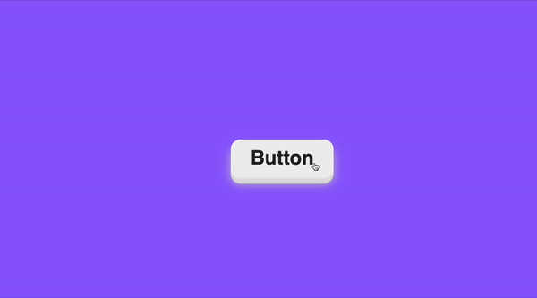

## Practical Examples and Projects

In this chapter, we will cover practical examples and projects that will help you understand the concepts we have discussed so far. If you have purchased the book, you will receive four projects with code. The following images show the projects that you will receive with the book.

### Project 1: Animating a Navigation Menu 📋

### Project 2: Creating a Loader Animation ⏳

### Project 3: Building Interactive Form Elements 📝

### Project 4: Animating Button 🛎️

